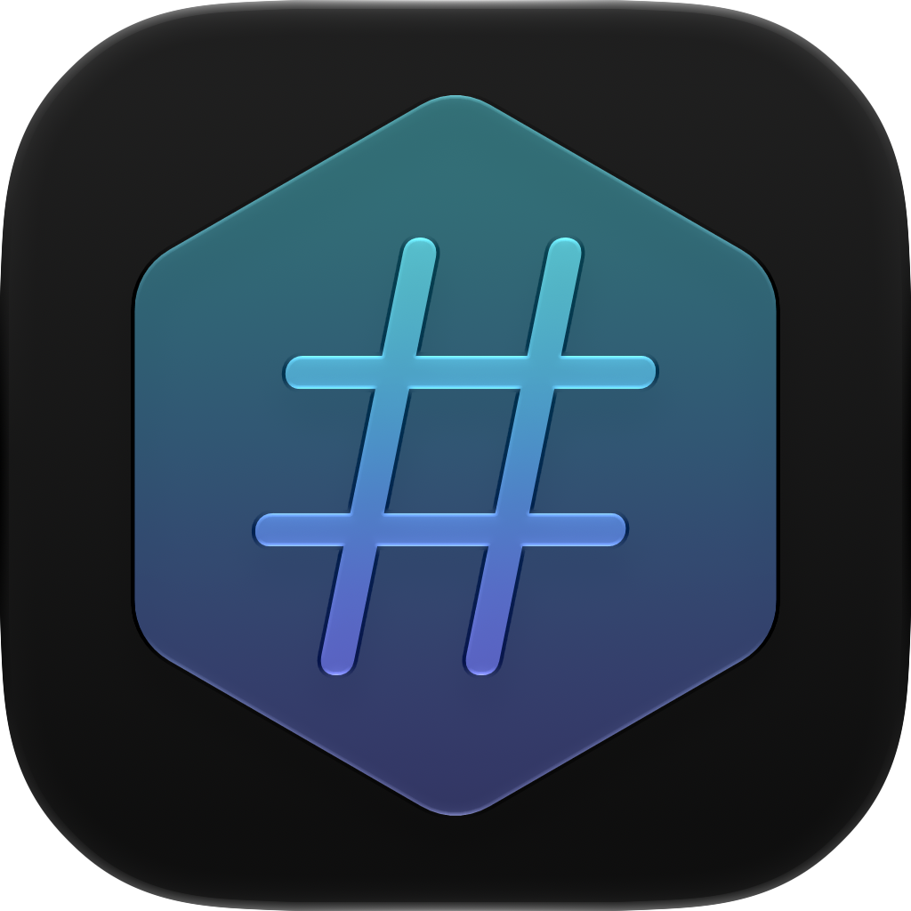

<p align="center">
  
</p>

<h1 align="center">Shaman</h1>

<p align="center">
  <a href="https://github.com/TWinston-66/Shaman/releases/latest"></a>
  <a href="#"></a>
  <a href="#"></a>
  <a href="LICENSE"></a>
</p>

Drag-and-drop based checksum tool for Apple Silicon Macs. Verify a file against an
expected digest, or generate one.

Drop files onto the window and hit **Hash**. Every file has its own algorithm and 
mode, so one batch can mix generations and checks with different algorithms. Hashes
are generated concurrently, then each file's digest and elapsed time are reported 
as they land.

The algorithms of pasted digests are inferred based on hash length. Pick a different 
one from the menu to override. Results show expected against got, with a symbol 
displaying match success.

## Details

- **Timing** Each files times its own hash in seconds and milliseconds
- **Insecure algorithms** are marked with a warning symbol in the algorithm dropdown
- **Duplicate drops are ignored** Files are matched on path, duplicates are ignored
- **Rows are colored by outcome** — green when the digest lands, red on error

## Supported algorithms

| Algorithm | Digest | Notes    |
| --------- | ------ | ---------|
| SHA-256   | 256bit | Default  |
| SHA-384   | 384bit |          |
| SHA-512   | 512bit |          |
| SHA-1     | 160bit | Insecure |
| MD5       | 128bit | Insecure |

## Installation

Download the latest `.zip` from [Releases](https://github.com/TWinston-66/Shaman/releases/latest),
unzip it, and move **Shaman.app** to `/Applications`.

Release builds are ad-hoc signed but **not notarized**, so Gatekeeper blocks the first
launch. Clear the quarantine flag:

```sh
xattr -dr com.apple.quarantine /Applications/Shaman.app
```

## Building from source

Requires Xcode 26 or later.

```sh
git clone https://github.com/TWinston-66/Shaman.git
cd Shaman
open Shaman.xcodeproj
```

Or from the command line:

```sh
xcodebuild build -project Shaman.xcodeproj -scheme Shaman -configuration Release
```

The project has `DEVELOPMENT_TEAM` set to the maintainer's Apple team, so signing will
fail for anyone else. Set your own team in **Signing & Capabilities**, or build ad-hoc
signed the way CI does:

```sh
xcodebuild build -project Shaman.xcodeproj -scheme Shaman -configuration Release \
  CODE_SIGN_IDENTITY="-" CODE_SIGN_STYLE=Manual DEVELOPMENT_TEAM=""
```

## Requirements

- macOS 26.0 or later
- Apple Silicon

## How it works

Files are read in 1 MiB chunks through `FileHandle` and streamed into
[CryptoKit](https://developer.apple.com/documentation/cryptokit), so memory use stays
flat regardless of file size. Hashing runs off the main actor with progress reported
back per percentage point, and each file's task is cancelled if its row goes away.

The app is sandboxed and holds only the `user-selected.read-only` entitlement: it can
read the files you drop on it and nothing else. There is no network access.

`scripts/generate.sh` writes incompressible test files (1M through 20G) if you want to
benchmark against large inputs.

## License

[MIT](LICENSE)
